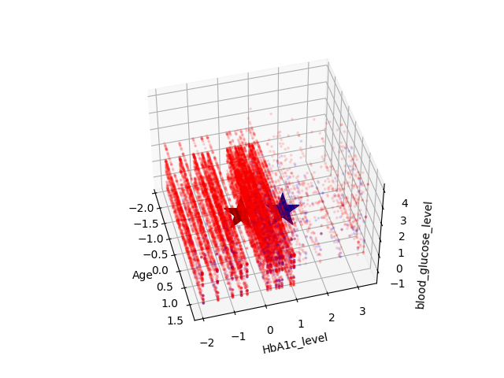

# Comparación de KNN y K Means

En esta práctica usando un conjunto de datos sobre la diabetes veremos como se desempeñan los algoritmos de K_Means y KNN a la hora de predecir si una persona tiene o no diabetes.

## KNN

El algoritmo de k vecinos más cercanos, también conocido como KNN o k-NN, es un clasificador de aprendizaje supervisado no paramétrico, que utiliza la proximidad para hacer clasificaciones o predicciones sobre la agrupación de un punto de datos individual.

Si bien se puede usar para problemas de regresión o clasificación, generalmente se usa como un algoritmo de clasificación, partiendo de la suposición de que se pueden encontrar puntos similares cerca uno del otro.

Ventajas:
- Resulta más preciso a comparación de K Means
- Es más sencillo de programar.

Desventajas:
- Es muy lento de entrenar y para realizar las predicciones por lo que tuve que optimizar usando lo máximo posible usando numba y vectorización.

Gráfica:

## K Means

K-means es un algoritmo de clasificación no supervisada (clusterización) que agrupa objetos en k grupos basándose en sus características. El agrupamiento se realiza minimizando la suma de distancias entre cada objeto y el centroide de su grupo o cluster. Se suele usar la distancia cuadrática.

Ventajas:
- Su tiempo de procesamiento es rápido.
- Apenas requiere optimización.

Desventajas:
- Es algo más complejo de programar.
- Su precisión no es tan buena y concisa conforme a KNN.
- La precisión varía mucho dependiendo del azar de los centroides iniciales.

Gráfica:

